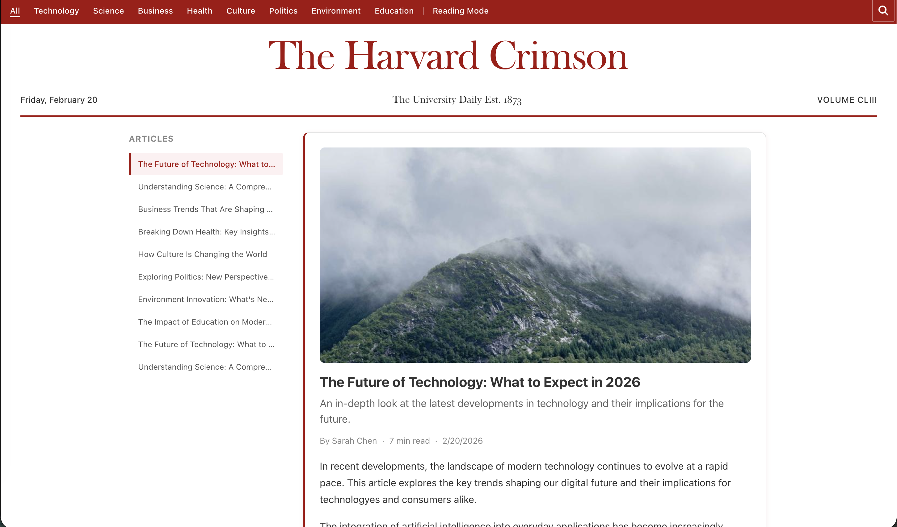

# The Crimson Mock Article Reader!

***Noah's Submission to the Crim Tech front-end comp***

A paginated, infinite-scrolling mock article reader styled after The Harvard Crimson, built with React and TypeScript.

[](https://youtu.be/KvqABy8IDS4)
**[Watch the demo video](https://youtu.be/KvqABy8IDS4)**

---

## Features

### Infinite Scroll Feed
- Cursor-based pagination loading 10 articles at a time
- Automatically fetches the next page as the user scrolls near the bottom
- Displays full article content (title, metadata, images, and HTML body) inline
- "You're all caught up!" indicator when all articles have been loaded

### Search
- Real-time search with 300ms debounce
- Filters articles by title, summary, and author via the API
- Clear button for quick reset; auto-focuses on open

### Category Filtering
- Filter by 8 categories: Technology, Science, Business, Health, Culture, Politics, Environment, Education
- Toggle selection on/off; works in combination with search

### Active Article Tracking
- Intersection Observer detects the most visible article in the viewport
- Active article highlighted with a crimson left border in the feed and sidebar
- URL updates to reflect the current article (`/read/:articleId`)

### Two-Column Desktop Layout
- Fixed sidebar listing all loaded articles with click-to-scroll navigation
- Main content area (max 750px) for comfortable reading
- Sidebar hides on tablet and mobile for a clean single-column view

### Reading Mode
- Center articles on page, use larger font sizes and increased line height for focused reading
- Sidebar hidden to reduce distractions

### Crimson Header & Navigation
- Sticky nav bar with the Crimson's signature color scheme
- Collapsible masthead that smoothly animates away on scroll
- Desktop: inline category links with active underline indicators
- Mobile/tablet: hamburger menu with slide-open dropdown

### Session Persistence
- Saves search query, active category, loaded articles, pagination cursor, and scroll position to `sessionStorage`
- Restores full state on page reload

### Responsive Design
- Desktop (>960px): two-column layout with full nav
- Tablet (768px–960px): single column, hamburger menu
- Mobile (<768px): full-width responsive sizing with adjusted typography

### Loading & Error States
- Spinner during initial load and pagination
- Error display with retry button
- Empty-state messages for no results

---

## How to Run

1. **Start the mock API server** (in a separate terminal):
   ```bash
   cd api-server
   npm install
   npm run dev
   ```
   The API will run on `http://localhost:3001`.

2. **Start the frontend** (in the project root):
   ```bash
   npm install
   npm run dev
   ```
   The frontend will run on `http://localhost:5173`.

3. Open `http://localhost:5173/read` in your browser.